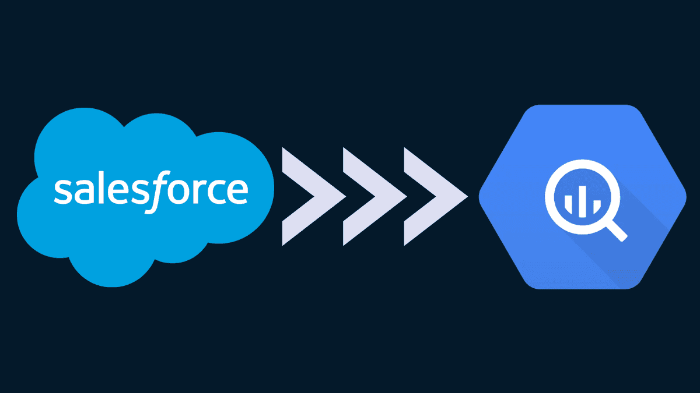

# Salesforce to Bigquery Data Sync API

This is an API backend to synchronize Salesforce data with BigQuery, both historically and on a daily basis, using Amazon EventBridge for scheduling.

API backend: Python-Flask

Database: Bigquery, SQLite

Docker: Run on Amazon ECS

Scheduler: Amazon EventBridge

# APIs

`docker run -p 4444:4444 199091131158.dkr.ecr.eu-north-1.amazonaws.com/salesforce-api:latest`

## get_oauth_url(redirect_uri)
`curl -k --form redirect_uri='https://127.0.0.1/login/callback' https://51.20.4.66:4444/get_oauth_url`

> https://login.salesforce.com/services/oauth2/authorize?response_type=code&client_id=3MVG9KsVczVNcM8wVBVq0QCAozkXTwm4Bh4g0lJc2utUP9koOg7ITHalGgpBcwCbn1ofHpB41kmkmc4rosqsj&redirect_uri=https://127.0.0.1/login/callback

## login_oauth_callback(redirect_uri, authorization_code)
`curl -k --form redirect_uri='https://127.0.0.1/login/callback' --form authorization_code='aPrx.f3G28C1uehwmBQ3uqiyEbS3Hm8piTdzdtNFS7ZFPFo6xAq24KV.lFps.mpFXzs0t1481g==' https://51.20.4.66:4444/login_oauth_callback`

> https://login.salesforce.com/id/00D1U000000rQgaUAE/0051U0000022xRgQAI

## create_importing_job(user_id, object_name, start_date)
`curl -k --form user_id='https://login.salesforce.com/id/00D1U000000rQgaUAE/0051U0000022xRgQAI' --form object_name='Account' --form start_date='2024-03-10' https://51.20.4.66:4444/create_importing_job`

> OK

## pause_importing_job(user_id, object_name)
`curl -k --form user_id='https://login.salesforce.com/id/00D1U000000rQgaUAE/0051U0000022xRgQAI' --form object_name='Account' https://51.20.4.66:4444/pause_importing_job`

> OK

## resume_importing_job(user_id, object_name)
`curl -k --form user_id='https://login.salesforce.com/id/00D1U000000rQgaUAE/0051U0000022xRgQAI' --form object_name='Account' https://51.20.4.66:4444/resume_importing_job`

> OK

## handle_importing_job
`curl -k https://51.20.4.66:4444/handle_importing_job`

> OK

# Sequence diagram

1. Call create_importing_job with start_date `2023-03-01`

    user_id | object_name | start_date | last_date | active
    --- | --- | --- | --- | ---
    user_1 | Account | 2023-03-01 | `2023-03-01` | 1

2. Call handle_importing_job on `2023-03-20`

    Import Account records from `2023-03-01` to `2023-03-19`

    user_id | object_name | start_date | last_date | active
    --- | --- | --- | --- | ---
    user_1 | Account | 2023-03-01 | `2023-03-20` | 1

3. Call handle_importing_job on `2023-03-21`

    Import Account records from `2023-03-20` to `2023-03-20`

    user_id | object_name | start_date | last_date | active
    --- | --- | --- | --- | ---
    user_1 | Account | 2023-03-01 | `2023-03-21` | 1

4. Call handle_importing_job on `2023-03-22`

    Import Account records from `2023-03-21` to `2023-03-21`

    user_id | object_name | start_date | last_date | active
    --- | --- | --- | --- | ---
    user_1 | Account | 2023-03-01 | `2023-03-22` | 1

5. Call pause_importing_job

    user_id | object_name | start_date | last_date | active
    --- | --- | --- | --- | ---
    user_1 | Account | 2023-03-01 | 2023-03-22 | `0`

5. Call resume_importing_job

    user_id | object_name | start_date | last_date | active
    --- | --- | --- | --- | ---
    user_1 | Account | 2023-03-01 | 2023-03-22 | `1`

6. Call handle_importing_job on `2023-03-25`

    Import Account records from `2023-03-22` to `2023-03-24`

    user_id | object_name | start_date | last_date | active
    --- | --- | --- | --- | ---
    user_1 | Account | 2023-03-01 | `2023-03-25` | 1
    
